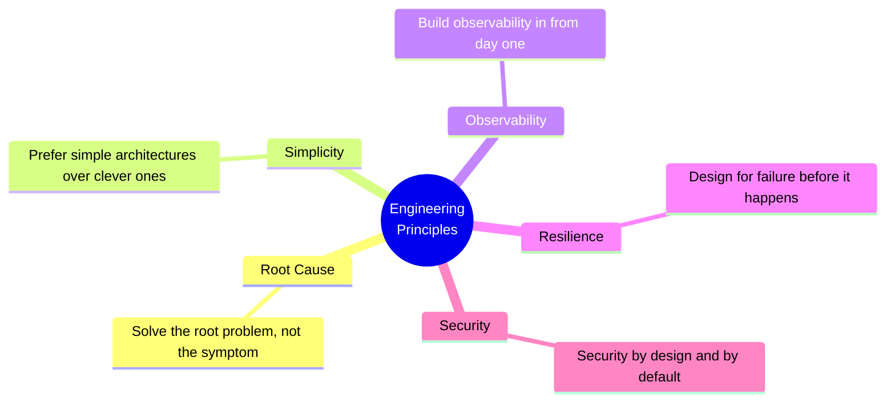
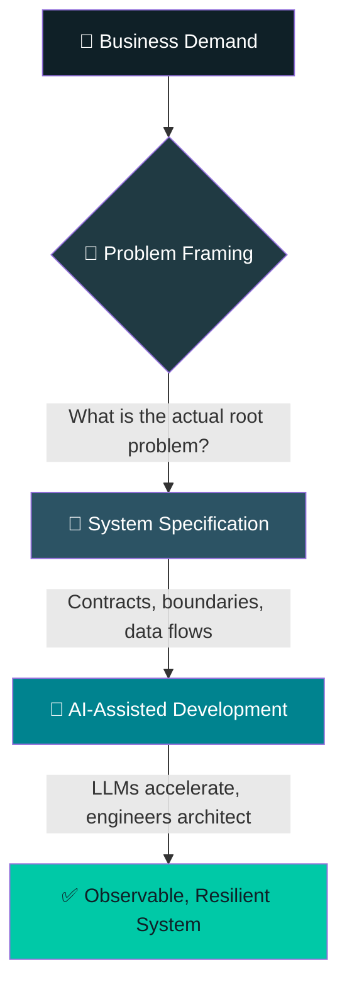

<div align="center">


<br/>

[](https://git.io/typing-svg)

<br/>

[](https://www.linkedin.com/in/chrisJSeng-fullstackdev)
[](mailto:highlander.all@gmail.com)
[](https://wa.me/5511910134533)
[](tel:+5511910134533)

<br/>


</div>

<br/>

## 🧭 What I Actually Do

> Most engineering fails not because of bad code, but because of **bad problem framing**.

My work sits at the intersection of two disciplines:

<table>
<tr>
<td width="50%" valign="top">

### 🎯 1 · Product Engineering
I bridge the gap between business intent and technical execution — translating vague requirements into precise system specifications, then guiding implementation with AI-assisted development. I use LLMs as force multipliers for design, spec writing, and code generation, but I own the architectural decisions.

</td>
<td width="50%" valign="top">

### 🏗️ 2 · Systems Engineering
I design and build distributed systems, data pipelines, and intelligence platforms that are observable, fault-tolerant, and maintainable at scale. The emphasis is always on simplicity and resilience over cleverness.

</td>
</tr>
</table>

---

## ⚙️ Engineering Principles



---

## 🧩 What I Build

<table>
<tr>
<td width="25%" valign="top" align="center">

### 🌐
**Distributed Platforms**
<sub>Systems composed of multiple services and workers communicating through message-driven architectures — event-based, asynchronous, fault-tolerant.</sub>

</td>
<td width="25%" valign="top" align="center">

### 🕸️
**Intelligence & Correlation**
<sub>Platforms that ingest, process, and correlate large volumes of data using entity correlation, graph-based modeling, and automated enrichment pipelines.</sub>

</td>
<td width="25%" valign="top" align="center">

### 🛡️
**Security & OSINT**
<sub>OSINT collectors, vulnerability intelligence pipelines, observable correlation engines, distributed scanning infrastructure, threat intelligence graphs.</sub>

</td>
<td width="25%" valign="top" align="center">

### 🤖
**Applied AI Systems**
<sub>AI as a force multiplier for engineering — automated analysis pipelines, data enrichment, anomaly detection, pattern discovery, decision support.</sub>

</td>
</tr>
</table>

---

## 🔄 From Problem to System: My Process



I treat every project as a product problem first, a technical problem second. This means understanding **why** before **how**, and documenting decisions so future engineers (or AI tools) can understand the reasoning behind the system.

---

## 🛠️ Tech Stack

<div align="center">


</div>

<details>
<summary><b>📦 Stack details</b></summary>
<br/>

<table>
<tr>
<td valign="top" width="33%">

**Backend**
- Node.js / TypeScript
- NestJS
- REST & Event-Driven APIs

**Messaging & Streaming**
- Apache Kafka
- Asynchronous pipelines
- Distributed workers

</td>
<td valign="top" width="33%">

**Data Storage**
- PostgreSQL
- Graph databases
- OpenSearch / Elasticsearch
- Object storage

**Infrastructure**
- Docker
- Containerized environments
- Distributed orchestration

</td>
<td valign="top" width="33%">

**AI & Intelligence**
- LLM-based pipelines
- Semantic analysis
- Automated classification
- Graph-based intelligence

**Security & OSINT**
- Correlation engines
- Threat intelligence graphs
- Vulnerability pipelines

</td>
</tr>
</table>

</details>

---

## 📊 GitHub Stats

<div align="center">


<br/>


<br/>


</div>

---

## 🐍 Contribution Snake

<div align="center">


</div>

---

## 🧠 Current Explorations

```yaml
interests:
  - graph-native intelligence platforms
  - distributed execution fabrics
  - OSINT automation pipelines
  - security-focused data correlation
  - scalable worker execution models
  - applied AI for intelligence analysis
  - AI-accelerated product specification
```

---

## 🧩 Problems I Enjoy Solving

<details open>
<summary><b>Click here</b></summary>

- 🔹 Systems that process large volumes of data reliably
- 🔹 Orchestrating distributed tools and workers
- 🔹 Correlating fragmented, noisy data sources
- 🔹 Building intelligence layers on top of raw data
- 🔹 Reducing operational complexity in distributed environments
- 🔹 Making complex systems observable and debuggable
- 🔹 Translating ambiguous business needs into precise technical specs

</details>

---

## 📂 This GitHub

Projects here are **experiments, explorations, and implementations** in:

| Área | Foco |
|---|---|
| 🌐 Distributed execution systems | Workers, filas, orquestração |
| 📡 Kafka-based pipelines | Streaming, event-driven design |
| 🕵️ OSINT automation | Coleta, correlação, enriquecimento |
| 🕸️ Intelligence graph modeling | Grafos de entidades e relações |
| 🛡️ Security tooling | Scanners, fingerprinting, CVEs |
| 🔍 Data extraction pipelines | ETL, parsing, normalização |

Many are architecture pattern explorations rather than finished products. The goal is to work through ideas in code.

---

## 🤝 Collaboration


If you are working on difficult problems in these areas, **open an issue** or **start a discussion**.

---

<div align="center">

### 💬
*"The best system design is the one that makes the problem obvious."*

<br/>


</div>
